# Starbucks Capstone Challenge

<h2> Project Overview </h2> 


The aim of the project is to develop a strategy for giving offers (like discounts or bogoffs) to user of the Starbucks rewards app.

The main way this will be done is building a classification model to determine the likelihood of a user viewing or completing an offer. Ideally we would also try to estimate how a user's spend would be impacted by an offer, or combination of offers, unfortunately this does not appear to be a tractable machine learning problem. At least with the data available.

The data set is imbalanced, particularly the viewed/not viewed classes, and so performance of the model will be measured by it's f1-scores on each class. Since the model will be used to output estimates of probabilities it is important that the model performs well on both positive and negative classes.


<H2> Data Exploration </H2>

<b> Offers </b>

The offers that Starbucks sent out are as follows. The reward is the value of product for a bogoff and value of the discount otherwise. Similarly the difficulty is the required spend to complete the offer.

<table border="1" class="dataframe">
  <thead>
    <tr style="text-align: center;">
      <th></th>
      <th>Reward</th>
      <th>Difficulty</th>
      <th>Duration</th>
      <th>Offer Type</th>
      <th>Email</th>
      <th>Mobile</th>
      <th>Social</th>
      <th>Web</th>
      <th>Name</th>
    </tr>
    <tr>
      <th>offer_id</th>
      <th></th>
      <th></th>
      <th></th>
      <th></th>
      <th></th>
      <th></th>
      <th></th>
      <th></th>
      <th></th>
    </tr>
  </thead>
  <tbody>
    <tr>
      <th>9b98b8c7a33c4b65b9aebfe6a799e6d9</th>
      <td>5</td>
      <td>5</td>
      <td>7</td>
      <td>bogo</td>
      <td>1.0</td>
      <td>1.0</td>
      <td>0.0</td>
      <td>1.0</td>
      <td>bogo,5,5,7</td>
    </tr>
    <tr>
      <th>f19421c1d4aa40978ebb69ca19b0e20d</th>
      <td>5</td>
      <td>5</td>
      <td>5</td>
      <td>bogo</td>
      <td>1.0</td>
      <td>1.0</td>
      <td>1.0</td>
      <td>1.0</td>
      <td>bogo,5,5,5</td>
    </tr>
    <tr>
      <th>ae264e3637204a6fb9bb56bc8210ddfd</th>
      <td>10</td>
      <td>10</td>
      <td>7</td>
      <td>bogo</td>
      <td>1.0</td>
      <td>1.0</td>
      <td>1.0</td>
      <td>0.0</td>
      <td>bogo,10,10,7</td>
    </tr>
    <tr>
      <th>4d5c57ea9a6940dd891ad53e9dbe8da0</th>
      <td>10</td>
      <td>10</td>
      <td>5</td>
      <td>bogo</td>
      <td>1.0</td>
      <td>1.0</td>
      <td>1.0</td>
      <td>1.0</td>
      <td>bogo,10,10,5</td>
    </tr>
    <tr>
      <th>fafdcd668e3743c1bb461111dcafc2a4</th>
      <td>2</td>
      <td>10</td>
      <td>10</td>
      <td>discount</td>
      <td>1.0</td>
      <td>1.0</td>
      <td>1.0</td>
      <td>1.0</td>
      <td>discount,2,10,10</td>
    </tr>
    <tr>
      <th>2906b810c7d4411798c6938adc9daaa5</th>
      <td>2</td>
      <td>10</td>
      <td>7</td>
      <td>discount</td>
      <td>1.0</td>
      <td>1.0</td>
      <td>0.0</td>
      <td>1.0</td>
      <td>discount,2,10,7</td>
    </tr>
    <tr>
      <th>2298d6c36e964ae4a3e7e9706d1fb8c2</th>
      <td>3</td>
      <td>7</td>
      <td>7</td>
      <td>discount</td>
      <td>1.0</td>
      <td>1.0</td>
      <td>1.0</td>
      <td>1.0</td>
      <td>discount,3,7,7</td>
    </tr>
    <tr>
      <th>0b1e1539f2cc45b7b9fa7c272da2e1d7</th>
      <td>5</td>
      <td>20</td>
      <td>10</td>
      <td>discount</td>
      <td>1.0</td>
      <td>0.0</td>
      <td>0.0</td>
      <td>1.0</td>
      <td>discount,5,20,10</td>
    </tr>
    <tr>
      <th>3f207df678b143eea3cee63160fa8bed</th>
      <td>0</td>
      <td>0</td>
      <td>4</td>
      <td>informational</td>
      <td>1.0</td>
      <td>1.0</td>
      <td>0.0</td>
      <td>1.0</td>
      <td>informational,0,0,4</td>
    </tr>
    <tr>
      <th>5a8bc65990b245e5a138643cd4eb9837</th>
      <td>0</td>
      <td>0</td>
      <td>3</td>
      <td>informational</td>
      <td>1.0</td>
      <td>1.0</td>
      <td>1.0</td>
      <td>0.0</td>
      <td>informational,0,0,3</td>
    </tr>
  </tbody>
</table>

<b> User Profiles </b>


There is a large peak of users with age 118, this must be a placeholder for no entry.

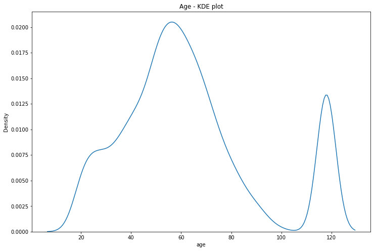

If we see these ages to NaN we see that they correspond to users for whom the gender and income is also missing. There's about 2000 of these people for whom we have basically no user data. We'll just drop them from the DataFrame.

| Column           | Count |
| ---------------- | ----- |
| Gender           | 2175  |
| Age              | 2175  |
| Became Member On | 0     |
| Income           | 2175  |
| Account Age      | 0     |

If we do a bar plot of a user's spend in the training period we see that the modal spend is only a few dollars - likely the cost of a single coffee. It is not uncommon however for users to spend in the 10-20 dollar range, and higher spend become increasingly uncommon.

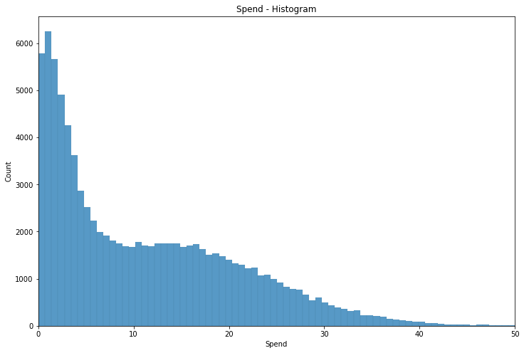
    

A plot of income versus spend reveals some clear clustering.    
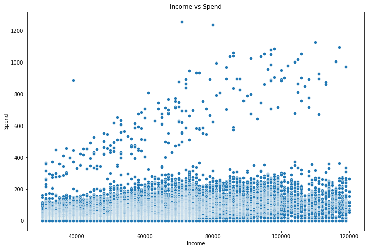
    


There's a very noticeable group of people with very high spend, especially compared to income. Although we are unlikely to be able to use raw spend and transaction data to predict offer uptake (since this data is partially a function of offers completed), these kinds of groupings might be useful both for the model itself as well as development of heuristics. 

If someone where to go to Starbucks every day and pay the mean transaction spend each day they would pay about $400.  Most of the people in the high spend cluster spent more than this. We'll call this group Big Spenders.

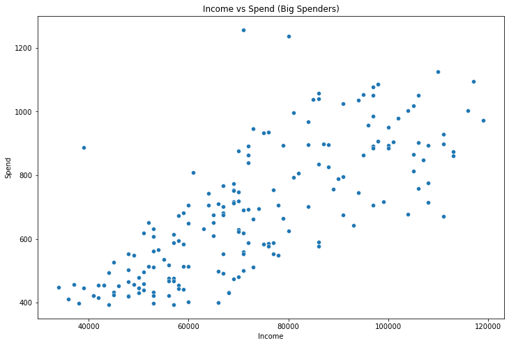

​    

To identify this group more methodically we can use K-means clustering. The data points we use for the clustering are

* Income
* Mean Spend
* Number of Transactions
* Spend/Income

 We see from an elbow plot that the optimum number of clusters is four.

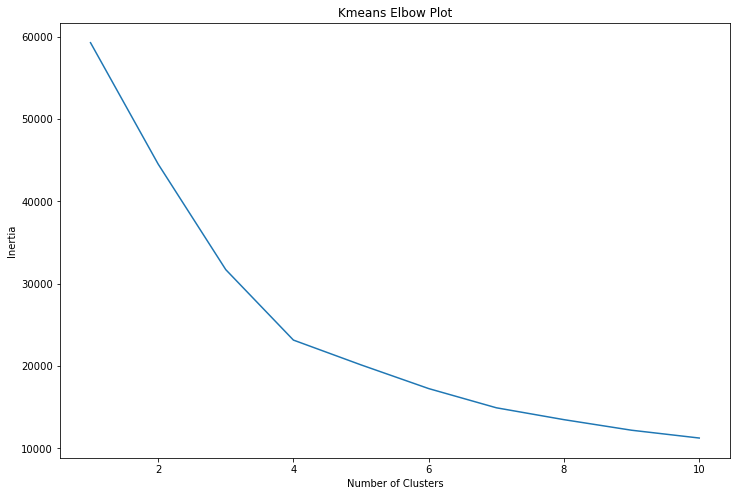

Once we do the clustering we see that cluster 3 corresponds to the expected Big Spender cluster.

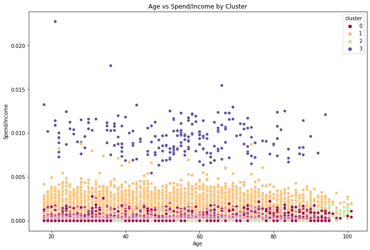

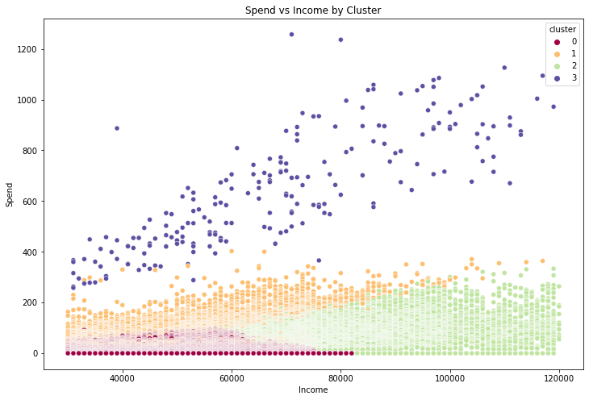


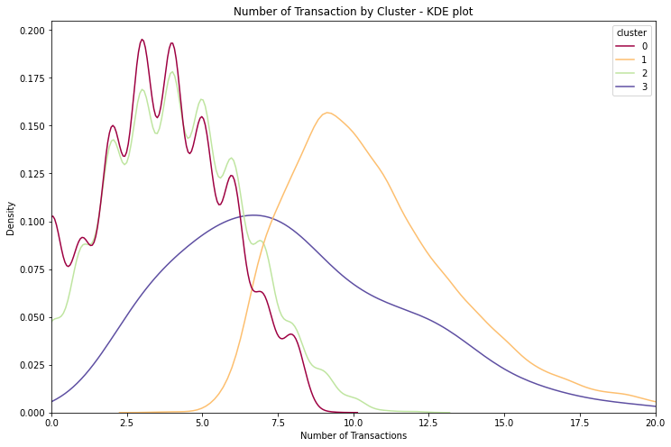

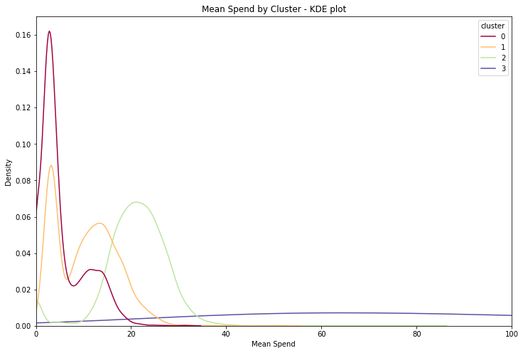

These clusters all have quite different spending patterns, exactly as we wanted. The big_spender cluster in particular is very different, having totally different mean spend distribution and a distinct number of transaction distribution as well.

<b> Offer Completion </b>


We can see that the impact of rewards are not uniform in how they affect spend. Users claiming a reward tend to spend significantly more than those who are not completing an offer - for which the average spend is about $10 and the modal spend about $2.50. 

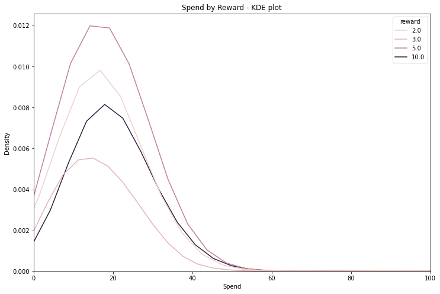

| Reward ($) | Mean Spend ($) |
| ---------- | -------------- |
| 0          | 10.6           |
| 2          | 20.0           |
| 3          | 17.5           |
| 5          | 21.2           |
| 10         | 23.2           |

We can also ask what proportion of offers are completed. 


<table border="1" class="dataframe">
  <thead>
    <tr style="text-align: Center;">
      <th>Name </th>
      <th>Viewed</th>
      <th>Completed</th>
    </tr>
  </thead>
  <tbody>
    <tr>
      <th>bogo,10,10,5</th>
      <td>0.956432</td>
      <td>0.478789</td>
    </tr>
    <tr>
      <th>bogo,10,10,7</th>
      <td>0.884469</td>
      <td>0.511061</td>
    </tr>
    <tr>
      <th>bogo,5,5,5</th>
      <td>0.953036</td>
      <td>0.600229</td>
    </tr>
    <tr>
      <th>bogo,5,5,7</th>
      <td>0.519257</td>
      <td>0.570684</td>
    </tr>
    <tr>
      <th>discount,2,10,10</th>
      <td>0.967377</td>
      <td>0.694608</td>
    </tr>
    <tr>
      <th>discount,2,10,7</th>
      <td>0.521993</td>
      <td>0.529399</td>
    </tr>
    <tr>
      <th>discount,3,7,7</th>
      <td>0.957282</td>
      <td>0.684844</td>
    </tr>
    <tr>
      <th>discount,5,20,10</th>
      <td>0.332224</td>
      <td>0.425150</td>
    </tr>
    <tr>
      <th>informational,0,0,3</th>
      <td>0.814573</td>
      <td>0.112565</td>
    </tr>
    <tr>
      <th>informational,0,0,4</th>
      <td>0.477578</td>
      <td>0.129372</td>
    </tr>
    <tr>
      <th>All</th>
      <th>0.736746</th>
      <th>0.472950</th>
    </tr>
  </tbody>
</table>

We can also think of this in terms of total rewards earned versus rewards offered. In both cases we see that about 50% of offers are completed/rewards are earned.
$$
\text{ Best Fit Equation: } y=0.53x
$$
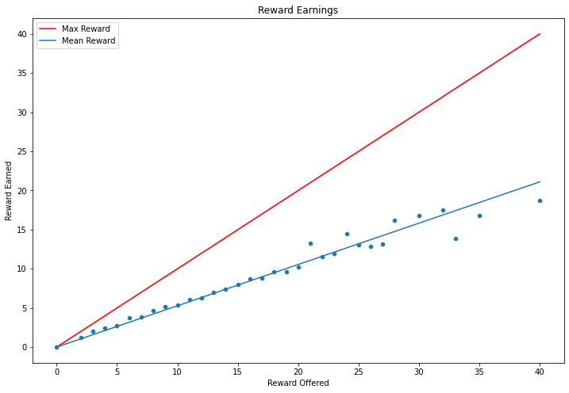
    


The poor fit towards the end is likely due, at least in part, to fewer people being offered the such large max rewards.

<h2> P_testing Offer Effectiveness </h2>

We can also ask whether these offers have a meaningful or (statistically) significant impact on user spending. To this end employ a t-test between offer recipients during the offer period and those who have received no offer in this same period. The table of results is as follows.  The p_x columns contain $-log(p)$ where $p$ is the p_value output of the t-test. A score above 3 can be considered significant. 


<div>
<style scoped>
    .dataframe tbody tr th:only-of-type {
        vertical-align: middle;
    }
<table border="1" class="dataframe">
  <thead>
    <tr style="text-align: Center;">
      <th></th>
      <th>p_age</th>
      <th>p_income</th>
      <th>p_total-cost</th>
      <th>total-cost</th>
      <th>p_total</th>
      <th>offered_total</th>
      <th>null_total</th>
      <th>p_mean</th>
      <th>offered_mean</th>
      <th>null_mean</th>
      <th>p_count</th>
      <th>offered_count</th>
      <th>null_count</th>
    </tr>
  </thead>
  <tbody>
    <tr>
      <th>discount,2,10,10</th>
      <td>0.373081</td>
      <td>0.513743</td>
      <td>251.415865</td>
      <td>30.652512</td>
      <td>283.408413</td>
      <td>46.875874</td>
      <td>14.223363</td>
      <td>36.634555</td>
      <td>13.352046</td>
      <td>8.858298</td>
      <td>inf</td>
      <td>3.280471</td>
      <td>1.043826</td>
    </tr>
    <tr>
      <th>discount,3,7,7</th>
      <td>0.472075</td>
      <td>0.418224</td>
      <td>187.476382</td>
      <td>18.569828</td>
      <td>249.576284</td>
      <td>33.467657</td>
      <td>11.897829</td>
      <td>32.359681</td>
      <td>11.840403</td>
      <td>8.185221</td>
      <td>inf</td>
      <td>2.492615</td>
      <td>0.867023</td>
    </tr>
    <tr>
      <th>bogo,5,5,5</th>
      <td>0.627717</td>
      <td>0.307679</td>
      <td>92.664772</td>
      <td>12.317879</td>
      <td>177.398431</td>
      <td>26.940110</td>
      <td>9.622231</td>
      <td>52.153454</td>
      <td>11.919873</td>
      <td>6.976287</td>
      <td>inf</td>
      <td>1.866667</td>
      <td>0.705882</td>
    </tr>
    <tr>
      <th>discount,2,10,7</th>
      <td>0.888283</td>
      <td>0.627830</td>
      <td>80.655369</td>
      <td>12.179083</td>
      <td>107.848849</td>
      <td>26.076912</td>
      <td>11.897829</td>
      <td>21.634059</td>
      <td>11.161493</td>
      <td>8.185221</td>
      <td>377.954748</td>
      <td>1.737208</td>
      <td>0.867023</td>
    </tr>
    <tr>
      <th>discount,5,20,10</th>
      <td>0.367586</td>
      <td>0.735100</td>
      <td>53.657970</td>
      <td>11.965843</td>
      <td>104.198406</td>
      <td>31.189206</td>
      <td>14.223363</td>
      <td>19.425179</td>
      <td>12.090161</td>
      <td>8.858298</td>
      <td>332.601467</td>
      <td>1.965403</td>
      <td>1.043826</td>
    </tr>
    <tr>
      <th>bogo,10,10,7</th>
      <td>0.949229</td>
      <td>0.115336</td>
      <td>48.955730</td>
      <td>9.915389</td>
      <td>184.972483</td>
      <td>31.813218</td>
      <td>11.897829</td>
      <td>29.090939</td>
      <td>11.862773</td>
      <td>8.185221</td>
      <td>inf</td>
      <td>2.413184</td>
      <td>0.867023</td>
    </tr>
    <tr>
      <th>bogo,5,5,7</th>
      <td>0.725452</td>
      <td>0.584020</td>
      <td>40.097766</td>
      <td>7.913657</td>
      <td>101.293686</td>
      <td>24.811486</td>
      <td>11.897829</td>
      <td>14.263930</td>
      <td>10.484330</td>
      <td>8.185221</td>
      <td>372.677502</td>
      <td>1.742637</td>
      <td>0.867023</td>
    </tr>
    <tr>
      <th>informational,0,0,3</th>
      <td>0.952612</td>
      <td>0.920038</td>
      <td>108.007086</td>
      <td>6.960021</td>
      <td>108.007086</td>
      <td>13.918947</td>
      <td>6.958925</td>
      <td>49.624650</td>
      <td>8.354929</td>
      <td>5.289228</td>
      <td>420.722524</td>
      <td>1.116625</td>
      <td>0.522302</td>
    </tr>
    <tr>
      <th>bogo,10,10,5</th>
      <td>0.178025</td>
      <td>0.665663</td>
      <td>34.850332</td>
      <td>6.925740</td>
      <td>189.016236</td>
      <td>26.547971</td>
      <td>9.622231</td>
      <td>59.501045</td>
      <td>11.383595</td>
      <td>6.976287</td>
      <td>inf</td>
      <td>1.933272</td>
      <td>0.705882</td>
    </tr>
    <tr>
      <th>informational,0,0,4</th>
      <td>0.489737</td>
      <td>0.747444</td>
      <td>59.748068</td>
      <td>5.720949</td>
      <td>59.748068</td>
      <td>13.865758</td>
      <td>8.144809</td>
      <td>25.925570</td>
      <td>8.166071</td>
      <td>6.139471</td>
      <td>220.613258</td>
      <td>1.012556</td>
      <td>0.597345</td>
    </tr>
  </tbody>
</table>


The key figures here are that age and income seem similarly distributed across null and test groups; and that the $p_{total-cost}$ value is always large. This means that we can reject the hypothesis that the total spend of people to whom the offer was made was lower than the total spend of those who it wasn't plus the monetary value of the offer itself. That is the impact of the offer was both significant and meaningful. Although these tests were aggregated into one number for each offer, the information used was only from the periods in which the offer was active. 

Noticeably there was an increase in both mean spend and number of transactions among offered groups. 


<table border="1" class="dataframe">
  <thead>
    <tr style="text-align: Center;">
      <th>Offer</th>
      <th>Increase in Spend/ Duration</th>
      <th>Reward</th>
      <th>Difficulty</th>
      <th>Duration</th>
      <th>Offer_type</th>
      <th>Email</th>
      <th>Mobile</th>
      <th>Social</th>
      <th>Web</th>
    </tr>
  </thead>
  <tbody>
    <tr>
      <th>discount,2,10,10</th>
      <td>3.065251</td>
      <td>2</td>
      <td>10</td>
      <td>10</td>
      <td>discount</td>
      <td>1.0</td>
      <td>1.0</td>
      <td>1.0</td>
      <td>1.0</td>
    </tr>
    <tr>
      <th>discount,3,7,7</th>
      <td>2.652833</td>
      <td>3</td>
      <td>7</td>
      <td>7</td>
      <td>discount</td>
      <td>1.0</td>
      <td>1.0</td>
      <td>1.0</td>
      <td>1.0</td>
    </tr>
    <tr>
      <th>bogo,5,5,5</th>
      <td>2.463576</td>
      <td>5</td>
      <td>5</td>
      <td>5</td>
      <td>bogo</td>
      <td>1.0</td>
      <td>1.0</td>
      <td>1.0</td>
      <td>1.0</td>
    </tr>
    <tr>
      <th>informational,0,0,3</th>
      <td>2.320007</td>
      <td>0</td>
      <td>0</td>
      <td>3</td>
      <td>informational</td>
      <td>1.0</td>
      <td>1.0</td>
      <td>1.0</td>
      <td>0.0</td>
    </tr>
    <tr>
      <th>discount,2,10,7</th>
      <td>1.739869</td>
      <td>2</td>
      <td>10</td>
      <td>7</td>
      <td>discount</td>
      <td>1.0</td>
      <td>1.0</td>
      <td>0.0</td>
      <td>1.0</td>
    </tr>
    <tr>
      <th>informational,0,0,4</th>
      <td>1.430237</td>
      <td>0</td>
      <td>0</td>
      <td>4</td>
      <td>informational</td>
      <td>1.0</td>
      <td>1.0</td>
      <td>0.0</td>
      <td>1.0</td>
    </tr>
    <tr>
      <th>bogo,10,10,7</th>
      <td>1.416484</td>
      <td>10</td>
      <td>10</td>
      <td>7</td>
      <td>bogo</td>
      <td>1.0</td>
      <td>1.0</td>
      <td>1.0</td>
      <td>0.0</td>
    </tr>
    <tr>
      <th>bogo,10,10,5</th>
      <td>1.385148</td>
      <td>10</td>
      <td>10</td>
      <td>5</td>
      <td>bogo</td>
      <td>1.0</td>
      <td>1.0</td>
      <td>1.0</td>
      <td>1.0</td>
    </tr>
    <tr>
      <th>discount,5,20,10</th>
      <td>1.196584</td>
      <td>5</td>
      <td>20</td>
      <td>10</td>
      <td>discount</td>
      <td>1.0</td>
      <td>0.0</td>
      <td>0.0</td>
      <td>1.0</td>
    </tr>
    <tr>
      <th>bogo,5,5,7</th>
      <td>1.130522</td>
      <td>5</td>
      <td>5</td>
      <td>7</td>
      <td>bogo</td>
      <td>1.0</td>
      <td>1.0</td>
      <td>0.0</td>
      <td>1.0</td>
    </tr>
  </tbody>
</table>


While all the measures are deemed effective by our p_tests, there does seem to be differences in performance. Roughly speaking it looks like the 2,10,10 discount performs best, but comparing the offers like this is on shaky statistical footing. There may be other factors impacting performance, e.g. people might be more likely to buy coffee on a Monday, so offers which include a (or multiple) Mondays might get a boost. 
   

<h2> Offer Classification </h2>

<b> Random Forest Model - Offer by offer prediction </b>

We will use a random forest classifier to predict whether a user will view or complete a given offer.  Initially a model is fitted for each offer individually so only information about the user is relevant.

The data points used for the predictions are:

* Age (Int)
* Income (Int)
* Account age (Int)
* Big Spender Cluster (Bool)
* Cluster 2 (Bool)
* Male (Bool)
* Female (Bool)
* Mean Spend (Float)

The Cluster 0 and Cluster 1 data points are not used because they don't improve the predictive power of the model. 

In addition to the base classifier SMOTE is used to resample the data due to the imbalanced nature of the data set. Further the parameters are tuned with a grid search carried out independently for each offer. The parameter grid is generated by

```python
param_grid={
    'criterion':['gini', 'entropy'],
    'min_samples_split':np.logspace(-5,-1,5),
    'min_samples_leaf':np.logspace(-6,-2,5),
}
```

The best parameters are then used to refit a model on the entire test set. 

We collect the results for each offer below.

<table border="1" class="dataframe">
  <thead>
    <tr style="text-align: center;">
      <th>Type</th>
      <th>Offer</th>
      <th>Metric</th>
      <th>Not Viewed</th>
      <th>Viewed</th>
      <th>Not Completed</th>
      <th>Completed</th>
    </tr>
  </thead>
  <tbody>
    <tr>
      <th rowspan="16" valign="top">bogo</th>
      <th rowspan="4" valign="top">bogo,10,10,5</th>
      <th>f1-score</th>
      <td>0.470588</td>
      <td>0.976853</td>
      <td>0.799180</td>
      <td>0.843949</td>
    </tr>
    <tr>
      <th>precision</th>
      <td>0.758621</td>
      <td>0.960902</td>
      <td>0.899654</td>
      <td>0.776557</td>
    </tr>
    <tr>
      <th>recall</th>
      <td>0.341085</td>
      <td>0.993343</td>
      <td>0.718894</td>
      <td>0.924150</td>
    </tr>
    <tr>
      <th>support</th>
      <td>129.000000</td>
      <td>2103.000000</td>
      <td>1085.000000</td>
      <td>1147.000000</td>
    </tr>
    <tr>
      <th rowspan="4" valign="top">bogo,10,10,7</th>
      <th>f1-score</th>
      <td>0.651357</td>
      <td>0.957582</td>
      <td>0.793616</td>
      <td>0.855714</td>
    </tr>
    <tr>
      <th>precision</th>
      <td>0.829787</td>
      <td>0.933168</td>
      <td>0.850236</td>
      <td>0.817647</td>
    </tr>
    <tr>
      <th>recall</th>
      <td>0.536082</td>
      <td>0.983307</td>
      <td>0.744066</td>
      <td>0.897498</td>
    </tr>
    <tr>
      <th>support</th>
      <td>291.000000</td>
      <td>1917.000000</td>
      <td>969.000000</td>
      <td>1239.000000</td>
    </tr>
    <tr>
      <th rowspan="4" valign="top">bogo,5,5,5</th>
      <th>f1-score</th>
      <td>0.375000</td>
      <td>0.978962</td>
      <td>0.661710</td>
      <td>0.805556</td>
    </tr>
    <tr>
      <th>precision</th>
      <td>0.642857</td>
      <td>0.965422</td>
      <td>0.651220</td>
      <td>0.813084</td>
    </tr>
    <tr>
      <th>recall</th>
      <td>0.264706</td>
      <td>0.992888</td>
      <td>0.672544</td>
      <td>0.798165</td>
    </tr>
    <tr>
      <th>support</th>
      <td>102.000000</td>
      <td>2109.000000</td>
      <td>794.000000</td>
      <td>1417.000000</td>
    </tr>
    <tr>
      <th rowspan="4" valign="top">bogo,5,5,7</th>
      <th>f1-score</th>
      <td>0.675980</td>
      <td>0.690486</td>
      <td>0.683483</td>
      <td>0.816823</td>
    </tr>
    <tr>
      <th>precision</th>
      <td>0.674460</td>
      <td>0.691976</td>
      <td>0.655530</td>
      <td>0.837491</td>
    </tr>
    <tr>
      <th>recall</th>
      <td>0.677507</td>
      <td>0.689003</td>
      <td>0.713927</td>
      <td>0.797151</td>
    </tr>
    <tr>
      <th>support</th>
      <td>1107.000000</td>
      <td>1164.000000</td>
      <td>797.000000</td>
      <td>1474.000000</td>
    </tr>
    <tr>
      <th rowspan="16" valign="top">discount</th>
      <th rowspan="4" valign="top">discount,2,10,10</th>
      <th>f1-score</th>
      <td>0.503704</td>
      <td>0.984566</td>
      <td>0.704268</td>
      <td>0.877370</td>
    </tr>
    <tr>
      <th>precision</th>
      <td>0.809524</td>
      <td>0.973133</td>
      <td>0.689552</td>
      <td>0.885204</td>
    </tr>
    <tr>
      <th>recall</th>
      <td>0.365591</td>
      <td>0.996270</td>
      <td>0.719626</td>
      <td>0.869674</td>
    </tr>
    <tr>
      <th>support</th>
      <td>93.000000</td>
      <td>2145.000000</td>
      <td>642.000000</td>
      <td>1596.000000</td>
    </tr>
    <tr>
      <th rowspan="4" valign="top">discount,2,10,7</th>
      <th>f1-score</th>
      <td>0.691812</td>
      <td>0.691812</td>
      <td>0.683951</td>
      <td>0.812317</td>
    </tr>
    <tr>
      <th>precision</th>
      <td>0.685506</td>
      <td>0.698236</td>
      <td>0.708440</td>
      <td>0.795977</td>
    </tr>
    <tr>
      <th>recall</th>
      <td>0.698236</td>
      <td>0.685506</td>
      <td>0.661098</td>
      <td>0.829341</td>
    </tr>
    <tr>
      <th>support</th>
      <td>1077.000000</td>
      <td>1097.000000</td>
      <td>838.000000</td>
      <td>1336.000000</td>
    </tr>
    <tr>
      <th rowspan="4" valign="top">discount,3,7,7</th>
      <th>f1-score</th>
      <td>0.488550</td>
      <td>0.984693</td>
      <td>0.597179</td>
      <td>0.840965</td>
    </tr>
    <tr>
      <th>precision</th>
      <td>0.761905</td>
      <td>0.974231</td>
      <td>0.532123</td>
      <td>0.883615</td>
    </tr>
    <tr>
      <th>recall</th>
      <td>0.359551</td>
      <td>0.995381</td>
      <td>0.680357</td>
      <td>0.802243</td>
    </tr>
    <tr>
      <th>support</th>
      <td>89.000000</td>
      <td>2165.000000</td>
      <td>560.000000</td>
      <td>1694.000000</td>
    </tr>
    <tr>
      <th rowspan="4" valign="top">discount,5,20,10</th>
      <th>f1-score</th>
      <td>0.882175</td>
      <td>0.758763</td>
      <td>0.733211</td>
      <td>0.743363</td>
    </tr>
    <tr>
      <th>precision</th>
      <td>0.885445</td>
      <td>0.753070</td>
      <td>0.850587</td>
      <td>0.656250</td>
    </tr>
    <tr>
      <th>recall</th>
      <td>0.878930</td>
      <td>0.764543</td>
      <td>0.644301</td>
      <td>0.857143</td>
    </tr>
    <tr>
      <th>support</th>
      <td>1495.000000</td>
      <td>722.000000</td>
      <td>1237.000000</td>
      <td>980.000000</td>
    </tr>
    <tr>
      <th rowspan="8" valign="top">informational</th>
      <th rowspan="4" valign="top">informational,0,0,3</th>
      <th>f1-score</th>
      <td>0.693997</td>
      <td>0.944073</td>
      <td>0.933436</td>
      <td>0.510397</td>
    </tr>
    <tr>
      <th>precision</th>
      <td>0.858696</td>
      <td>0.912099</td>
      <td>0.887152</td>
      <td>0.828221</td>
    </tr>
    <tr>
      <th>recall</th>
      <td>0.582310</td>
      <td>0.978369</td>
      <td>0.984816</td>
      <td>0.368852</td>
    </tr>
    <tr>
      <th>support</th>
      <td>407.000000</td>
      <td>1803.000000</td>
      <td>1844.000000</td>
      <td>366.000000</td>
    </tr>
    <tr>
      <th rowspan="4" valign="top">informational,0,0,4</th>
      <th>f1-score</th>
      <td>0.709934</td>
      <td>0.691404</td>
      <td>0.943843</td>
      <td>0.472813</td>
    </tr>
    <tr>
      <th>precision</th>
      <td>0.715939</td>
      <td>0.685289</td>
      <td>0.900962</td>
      <td>0.854701</td>
    </tr>
    <tr>
      <th>recall</th>
      <td>0.704028</td>
      <td>0.697630</td>
      <td>0.991010</td>
      <td>0.326797</td>
    </tr>
    <tr>
      <th>support</th>
      <td>1142.000000</td>
      <td>1055.000000</td>
      <td>1891.000000</td>
      <td>306.000000</td>
    </tr>
  </tbody>
</table>

Recall on classes with low support is predictably poor despite the resampling. This is a limitation of the data, there's only so much we can do to improve the performance here. That being said, we can also try building a model to classify on multiple offers at once. In particular we can start to use information about the offer such as whether it was sent by email. We can do this either for all offers at once or by offer type. 

<b> Random Forest Model - Alternative prediction methods </b>

Once again a grid search was run before a model was refit on the entire training set. This time the parameter grid was slightly expanded  since there are fewer models to build.


```python
param_grid={
    'criterion':['gini', 'entropy'],
    'min_samples_split':np.logspace(-5,-1,5),
    'min_samples_leaf':np.logspace(-6,-2,5),
}
```

To compare these models we consider their combined performance by offer type as well as their overall performance. A breakdown by offer is also possible but it is difficult to read such a large table and meaningfully interpret the results. 


<table border="1" class="dataframe">
  <thead>
    <tr style="text-align: center;">
      <th>Type</th>
      <th>Metric</th>
      <th>Method</th>
      <th>Not Viewed</th>
      <th>Viewed</th>
      <th>Not Completed</th>
      <th>Completed</th>
    </tr>
  </thead>
  <tbody>
    <tr>
      <th rowspan="10" valign="top">bogo</th>
      <th rowspan="3" valign="top">f1-score</th>
      <th>All at once</th>
      <td>0.521869</td>
      <td>0.915683</td>
      <td>0.730182</td>
      <td>0.830887</td>
    </tr>
    <tr>
      <th>Offer by offer</th>
      <td>0.645097</td>
      <td>0.927438</td>
      <td>0.738933</td>
      <td>0.829567</td>
    </tr>
    <tr>
      <th>Type by type</th>
      <td>0.567692</td>
      <td>0.879088</td>
      <td>0.731456</td>
      <td>0.792449</td>
    </tr>
    <tr>
      <th rowspan="3" valign="top">precision</th>
      <th>All at once</th>
      <td>0.667304</td>
      <td>0.881793</td>
      <td>0.777090</td>
      <td>0.800597</td>
    </tr>
    <tr>
      <th>Offer by offer</th>
      <td>0.697857</td>
      <td>0.913321</td>
      <td>0.765207</td>
      <td>0.811379</td>
    </tr>
    <tr>
      <th>Type by type</th>
      <td>0.487450</td>
      <td>0.921516</td>
      <td>0.688195</td>
      <td>0.832916</td>
    </tr>
    <tr>
      <th rowspan="3" valign="top">recall</th>
      <th>All at once</th>
      <td>0.428484</td>
      <td>0.952283</td>
      <td>0.688615</td>
      <td>0.863559</td>
    </tr>
    <tr>
      <th>Offer by offer</th>
      <td>0.599754</td>
      <td>0.941999</td>
      <td>0.714403</td>
      <td>0.848588</td>
    </tr>
    <tr>
      <th>Type by type</th>
      <td>0.679558</td>
      <td>0.840395</td>
      <td>0.780521</td>
      <td>0.755732</td>
    </tr>
    <tr>
      <th>support</th>
      <th>NaN</th>
      <td>1629.000000</td>
      <td>7293.000000</td>
      <td>3645.000000</td>
      <td>5277.000000</td>
    </tr>
    <tr>
      <th rowspan="10" valign="top">discount</th>
      <th rowspan="3" valign="top">f1-score</th>
      <th>All at once</th>
      <td>0.728989</td>
      <td>0.881592</td>
      <td>0.664318</td>
      <td>0.818087</td>
    </tr>
    <tr>
      <th>Offer by offer</th>
      <td>0.786861</td>
      <td>0.906455</td>
      <td>0.687559</td>
      <td>0.824842</td>
    </tr>
    <tr>
      <th>Type by type</th>
      <td>0.721246</td>
      <td>0.856631</td>
      <td>0.681159</td>
      <td>0.804071</td>
    </tr>
    <tr>
      <th rowspan="3" valign="top">precision</th>
      <th>All at once</th>
      <td>0.743580</td>
      <td>0.874098</td>
      <td>0.699023</td>
      <td>0.796653</td>
    </tr>
    <tr>
      <th>Offer by offer</th>
      <td>0.800000</td>
      <td>0.899968</td>
      <td>0.706602</td>
      <td>0.812565</td>
    </tr>
    <tr>
      <th>Type by type</th>
      <td>0.663415</td>
      <td>0.896841</td>
      <td>0.660832</td>
      <td>0.819563</td>
    </tr>
    <tr>
      <th rowspan="3" valign="top">recall</th>
      <th>All at once</th>
      <td>0.714960</td>
      <td>0.889215</td>
      <td>0.632896</td>
      <td>0.840706</td>
    </tr>
    <tr>
      <th>Offer by offer</th>
      <td>0.774147</td>
      <td>0.913036</td>
      <td>0.669515</td>
      <td>0.837496</td>
    </tr>
    <tr>
      <th>Type by type</th>
      <td>0.790123</td>
      <td>0.819873</td>
      <td>0.702777</td>
      <td>0.789154</td>
    </tr>
    <tr>
      <th>support</th>
      <th>NaN</th>
      <td>2754.000000</td>
      <td>6129.000000</td>
      <td>3277.000000</td>
      <td>5606.000000</td>
    </tr>
    <tr>
      <th rowspan="10" valign="top">informational</th>
      <th rowspan="3" valign="top">f1-score</th>
      <th>All at once</th>
      <td>0.606533</td>
      <td>0.826797</td>
      <td>0.917465</td>
      <td>0.000000</td>
    </tr>
    <tr>
      <th>Offer by offer</th>
      <td>0.706242</td>
      <td>0.852370</td>
      <td>0.938692</td>
      <td>0.493697</td>
    </tr>
    <tr>
      <th>Type by type</th>
      <td>0.612913</td>
      <td>0.775327</td>
      <td>0.901182</td>
      <td>0.086047</td>
    </tr>
    <tr>
      <th rowspan="3" valign="top">precision</th>
      <th>All at once</th>
      <td>0.713537</td>
      <td>0.775598</td>
      <td>0.847515</td>
      <td>0.000000</td>
    </tr>
    <tr>
      <th>Offer by offer</th>
      <td>0.744103</td>
      <td>0.831117</td>
      <td>0.894112</td>
      <td>0.839286</td>
    </tr>
    <tr>
      <th>Type by type</th>
      <td>0.587678</td>
      <td>0.795145</td>
      <td>0.849490</td>
      <td>0.196809</td>
    </tr>
    <tr>
      <th rowspan="3" valign="top">recall</th>
      <th>All at once</th>
      <td>0.527437</td>
      <td>0.885234</td>
      <td>1.000000</td>
      <td>0.000000</td>
    </tr>
    <tr>
      <th>Offer by offer</th>
      <td>0.672046</td>
      <td>0.874738</td>
      <td>0.987952</td>
      <td>0.349702</td>
    </tr>
    <tr>
      <th>Type by type</th>
      <td>0.640413</td>
      <td>0.756473</td>
      <td>0.959572</td>
      <td>0.055060</td>
    </tr>
    <tr>
      <th>support</th>
      <th>NaN</th>
      <td>1549.000000</td>
      <td>2858.000000</td>
      <td>3735.000000</td>
      <td>672.000000</td>
    </tr>
  </tbody>
</table>


<table border="1" class="dataframe">
  <thead>
    <tr style="text-align: center;">
      <th>Metric</th>
      <th>Method</th>
      <th>Not Viewed</th>
      <th>Viewed</th>
      <th>Not Completed</th>
      <th>Completed</th>
    </tr>
  </thead>
  <tbody>
    <tr>
      <th rowspan="3" valign="top">f1-score</th>
      <th>All at once</th>
      <td>0.646922</td>
      <td>0.886994</td>
      <td>0.782560</td>
      <td>0.800414</td>
    </tr>
    <tr>
      <th>Offer by offer</th>
      <td>0.728326</td>
      <td>0.906261</td>
      <td>0.797295</td>
      <td>0.813419</td>
    </tr>
    <tr>
      <th>Type by type</th>
      <td>0.649153</td>
      <td>0.852142</td>
      <td>0.776350</td>
      <td>0.770578</td>
    </tr>
    <tr>
      <th rowspan="3" valign="top">precision</th>
      <th>All at once</th>
      <td>0.719983</td>
      <td>0.859092</td>
      <td>0.784515</td>
      <td>0.798587</td>
    </tr>
    <tr>
      <th>Offer by offer</th>
      <td>0.759517</td>
      <td>0.893599</td>
      <td>0.798119</td>
      <td>0.812646</td>
    </tr>
    <tr>
      <th>Type by type</th>
      <td>0.590551</td>
      <td>0.889334</td>
      <td>0.737625</td>
      <td>0.814440</td>
    </tr>
    <tr>
      <th rowspan="3" valign="top">recall</th>
      <th>All at once</th>
      <td>0.587323</td>
      <td>0.916769</td>
      <td>0.780614</td>
      <td>0.802250</td>
    </tr>
    <tr>
      <th>Offer by offer</th>
      <td>0.699595</td>
      <td>0.919287</td>
      <td>0.796472</td>
      <td>0.814193</td>
    </tr>
    <tr>
      <th>Type by type</th>
      <td>0.720668</td>
      <td>0.817936</td>
      <td>0.819368</td>
      <td>0.731199</td>
    </tr>
    <tr>
      <th>support</th>
      <th>NaN</th>
      <td>5932.000000</td>
      <td>16280.000000</td>
      <td>10657.000000</td>
      <td>11555.000000</td>
    </tr>
  </tbody>
</table>


The Offer by Offer method is the clear winner here. It is the best in almost every case and never the worst. All at once often offers similar performance but performs really poorly in some areas, in particular predicting completion of informational offers and recall of Not Viewed is very poor. Type by Type does occasionally do better than Offer by Offer but is also often much worse, overall it the poorer choice. 

That being said they offer a degree of flexibility that the offer by offer does not, there is no scope to estimate performance on untested offer combinations using this method. A Random Forest model may not be the best choice for this kind of prediction, however.

<b> Alternative Model Testing </b>

Just as a sanity check, we can see how other types of model perform to confirm the choice of a random forest was sensible.  For speed and ease of comparison we use the models to predict against all the offers at once. We also don't use a grid search and add a standard scaler to the Pipeline. The models tested are as follows.

| Models                       | Initial |
| ---------------------------- | ------- |
| Logistic Regression          | LR      |
| Decision Tree Classifier     | DTC     |
| Linear Discriminant Analysis | LDA     |
| Random Forest Classifier     | RFC     |
| K-Neighbours Classifier      | KNC     |
| Gaussian Naive Bayes         | GNB     |
| SGDClassifier                | SGDC    |


<table border="1" class="dataframe">
  <thead>
    <tr style="text-align: center;">
      <th>Metric</th>
      <th>Model</th>
      <th>Not Viewed</th>
      <th>Viewed</th>
      <th>Not Completed</th>
      <th>Completed</th>
    </tr>
  </thead>
  <tbody>
    <tr>
      <th rowspan="7" valign="top">f1-score</th>
      <th>RFC</th>
      <td>0.642572</td>
      <td>0.878630</td>
      <td>0.763706</td>
      <td>0.771635</td>
    </tr>
    <tr>
      <th>KNC</th>
      <td>0.619437</td>
      <td>0.872887</td>
      <td>0.766370</td>
      <td>0.773149</td>
    </tr>
    <tr>
      <th>LR</th>
      <td>0.615140</td>
      <td>0.868381</td>
      <td>0.767676</td>
      <td>0.770751</td>
    </tr>
    <tr>
      <th>SGDC</th>
      <td>0.583110</td>
      <td>0.853203</td>
      <td>0.766043</td>
      <td>0.760177</td>
    </tr>
    <tr>
      <th>LDA</th>
      <td>0.638180</td>
      <td>0.850885</td>
      <td>0.740597</td>
      <td>0.752376</td>
    </tr>
    <tr>
      <th>DTC</th>
      <td>0.585024</td>
      <td>0.844201</td>
      <td>0.720325</td>
      <td>0.708758</td>
    </tr>
    <tr>
      <th>GNB</th>
      <td>0.591651</td>
      <td>0.841299</td>
      <td>0.710868</td>
      <td>0.747883</td>
    </tr>
    <tr>
      <th rowspan="7" valign="top">precision</th>
      <th>LDA</th>
      <td>0.588227</td>
      <td>0.881745</td>
      <td>0.727783</td>
      <td>0.765238</td>
    </tr>
    <tr>
      <th>RFC</th>
      <td>0.678927</td>
      <td>0.862939</td>
      <td>0.745974</td>
      <td>0.789779</td>
    </tr>
    <tr>
      <th>GNB</th>
      <td>0.565759</td>
      <td>0.856534</td>
      <td>0.732862</td>
      <td>0.728811</td>
    </tr>
    <tr>
      <th>LR</th>
      <td>0.646131</td>
      <td>0.854366</td>
      <td>0.742439</td>
      <td>0.797501</td>
    </tr>
    <tr>
      <th>KNC</th>
      <td>0.663649</td>
      <td>0.853886</td>
      <td>0.746883</td>
      <td>0.793245</td>
    </tr>
    <tr>
      <th>DTC</th>
      <td>0.572651</td>
      <td>0.851105</td>
      <td>0.679883</td>
      <td>0.755560</td>
    </tr>
    <tr>
      <th>SGDC</th>
      <td>0.598368</td>
      <td>0.845611</td>
      <td>0.728064</td>
      <td>0.803121</td>
    </tr>
    <tr>
      <th rowspan="7" valign="top">recall</th>
      <th>RFC</th>
      <td>0.609912</td>
      <td>0.894902</td>
      <td>0.782303</td>
      <td>0.754305</td>
    </tr>
    <tr>
      <th>KNC</th>
      <td>0.580748</td>
      <td>0.892752</td>
      <td>0.786901</td>
      <td>0.754046</td>
    </tr>
    <tr>
      <th>LR</th>
      <td>0.586986</td>
      <td>0.882862</td>
      <td>0.794689</td>
      <td>0.745738</td>
    </tr>
    <tr>
      <th>SGDC</th>
      <td>0.568611</td>
      <td>0.860934</td>
      <td>0.808201</td>
      <td>0.721592</td>
    </tr>
    <tr>
      <th>DTC</th>
      <td>0.597943</td>
      <td>0.837408</td>
      <td>0.765882</td>
      <td>0.667417</td>
    </tr>
    <tr>
      <th>GNB</th>
      <td>0.620027</td>
      <td>0.826597</td>
      <td>0.690157</td>
      <td>0.767979</td>
    </tr>
    <tr>
      <th>LDA</th>
      <td>0.697404</td>
      <td>0.822113</td>
      <td>0.753871</td>
      <td>0.739939</td>
    </tr>
  </tbody>
</table>


As we can see a Random Forest Classifier is the best performing but both the K-Neighbours Classifier and Linear Regression Classifier offer similar performance, especially the former. Linear Regression in particular might be used to build a model which is more suited to predicting the performance of offers which have not been tested here.

<h2> Offer Decision Making </h2>

There are many ways we could make the decision on what offers to suggest. We could for example send any offer we think will be accepted. Here we will use a rough estimate of the gain from sending an offer, calculated as 
$$
P(\text{completed})*(\text{difficulty}-P(\text{not viewed})*\text{reward}).
$$


Ideally we would replace $P(\text{completed})*P(\text{not viewed})$ with $P(\text{not viewed}| \text{completed})$ but since estimation of whether an offer would be viewed was already fairly poor, I worried such an estimate would be very inaccurate.

Similarly reward is used as an estimate of the cost of providing the offer but it is not a perfect representative. It likely over-estimates the gain of discounts verses buy one get one free offers as the marginal cost of providing a second coffee is likely much lower than menu price.


We use this to pick the top three offers, with no more than two of each type, for each user.

The first few entries of the resulting DataFrame look like this.

<table border="1" class="dataframe">
  <thead>
    <tr style="text-align: center;">
      <th>Person</th>
      <th>1st</th>
      <th>2nd</th>
      <th>3rd</th>
    </tr>
  </thead>
  <tbody>
    <tr>
      <th>ae6f43089b674728a50b8727252d3305</th>
      <td>discount,2,10,10</td>
      <td>bogo,10,10,5</td>
      <td>bogo,10,10,7</td>
    </tr>
    <tr>
      <th>ad1f0a409ae642bc9a43f31f56c130fc</th>
      <td>discount,2,10,10</td>
      <td>discount,5,20,10</td>
      <td>bogo,10,10,5</td>
    </tr>
    <tr>
      <th>dce784e26f294101999d000fad9089bb</th>
      <td>discount,2,10,10</td>
      <td>bogo,10,10,5</td>
      <td>discount,3,7,7</td>
    </tr>
    <tr>
      <th>4d0ebb94a5a94fe6afd9350c7b1477e4</th>
      <td>discount,2,10,10</td>
      <td>discount,5,20,10</td>
      <td>bogo,10,10,5</td>
    </tr>
    <tr>
      <th>7d7f271652d244f78b97c73cd734c553</th>
      <td>discount,5,20,10</td>
      <td>discount,2,10,10</td>
      <td>bogo,10,10,7</td>
    </tr>
  </tbody>
</table>

The discount,2,10,10 offer appears a lot in these rows. In fact we can count the number of times each offer is recommend and see this pattern holds in the rest of the DataFrame.

| Offer               | Count |
| ------------------- | ----- |
| Bogo,10,10,7        | 6367  |
| Bogo,10,10,5        | 7518  |
| Bogo,5,5,7          | 0     |
| Bogo,5,5,5          | 1608  |
| Discount,5,20,10    | 8221  |
| Discount, 2,10,10   | 14607 |
| Discount,2,10,7     | 499   |
| Discount,3,7,7      | 5655  |
| Informational,0,0,4 | 0     |
| Informational,0,0,3 | 0     |


By far and away the most suggested is the 2,10,10 discount. This is also the best performing offer according to the tentative analysis in the p-testing section which is reassuring. 

We might also want to combine these methods with other heuristics, like say never giving offers to people identified as big_spenders or sending a larger discount to people who haven't bought anything in a while. Conversely offers might be used to reward users who already spend a lot.

It is also clear both from the poor performance of the model itself and the predictions made that informational offers have not been handled well. They are very different in nature to the other offers and there is room for more exploration of when and how to use these kinds of offers.

Ultimately it isn't really possible to give a good measure of how effective this strategy is. This would require real world testing. An experiment could be run where different groups are given offers according to different strategies e.g. the method above, random allocation, everyone gets the same, etc. Performance could then be compared across groups and the best strategy could be found. 

As well as running a one off experiment this could be done as a continuous process. Since the rewards app collects all the relevant data models could be constantly updated and different A/B tests run each month with tweaked offer strategies in order to keep improving the performance.
